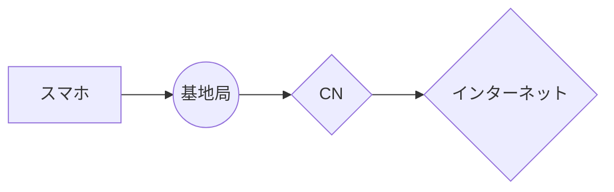

# コアネットワーク学習メモ

## コアネットワークの概要
コアネットワーク（CN）は、通信ネットワークの中核部分であり、音声通話、データ通信、メッセージングなど、さまざまな通信サービスを提供するための重要なインフラです。
コアネットワークは、エンドユーザーのデータの転送、セッションの管理、サービスの品質確保など、多くの役割を果たしています。
コアネットワークにて共通の装置としてコンポーネント化することで通信の効率化を図っています。

スマホがインターネットに接続するまでの通信経路

### コアネットワークの主要機能
- **データ転送**: ユーザーが実際に利用する音声やデータトラフィックを迅速かつ効率的に転送します。
  - *例*: スマートフォンで動画をストリーミングする際、コアネットワークは動画データをユーザーのデバイスに最適な経路で送信します。
- **セッション管理**: ユーザーのセッションを確立、維持、終了するための管理を行います。
  - *例*: VoIP通話中にユーザーが通話を開始したとき、コアネットワークは通話セッションを確立し、通話が終了するまで管理します。
- **トラフィック管理**: QoS（Quality of Service）を確保し、混雑時のトラフィックを最適に処理します。
  - *例*: ピーク時に多くのユーザーが同時にデータをダウンロードする場合、コアネットワークはトラフィックを調整し、各ユーザーに均等に帯域幅を提供します。

### コアネットワークの区分
コアネットワークは、通常、以下の三つの主要なコンポーネントに分かれます。
|                |名称                          |機能                         |例                         |
|----------------|-------------------------------|-----------------------------|-----------------------------|
|1|`CS（Circuit-Switched）`            |従来の回線交換方式を用いた音声通話に使用。            |昔の固定電話による通話が該当します。通話が確立すると、専用の回線が確保され、通話が終了するまでその回線が保持。            |
|2          |`SV（Signaling Virtualization）`            |信号処理の仮想化を行い、効率的な信号管理を実現。            |VoLTEなど、信号処理を仮想化することで、複数のサービスを同時に効率的に管理。            |
|3          |`PS（Packet-Switched）`|パケット交換方式を利用したデータ通信。|ウェブサイトの閲覧やデータのダウンロードなど、データをパケットとして送信。            |

### IMS基盤
- IMS（IP Multimedia Subsystem）は、コアネットワーク内でマルチメディアサービスを提供するためのアーキテクチャです。
  これにより、音声通話や動画通話、メッセージングなどのサービスをIPベースで統合的に管理します。
  なので、コントローラの役割を果たしている装置であると言えます。
  - *例*: スマートフォンのアプリを使ってビデオ通話を行う場合、IMSが通話の確立とメディアの転送を管理します。

### IMSの構成要素
以下の4つの装置に分かれています。

|                |名称                          |機能                         |
|----------------|-------------------------------|-----------------------------|
|1|`モバイルスイッチングセンター（MSC）`            |音声通話の管理やルーティングを行う。            |
|2          |`サービスポータル（SCP）`            |サービス提供のためのプラットフォーム。            |
|3          |`ゲートウェイ(GW)`|他のネットワーク（例えば、インターネット）との接続を担当。|
|4          |`データベース(HSS)`|ユーザー情報やネットワークの設定情報を保持する。|

## U-PlaneとC-Planeの関係
コアネットワークにおけるU-Plane（User Plane）とC-Plane（Control Plane）は、
データの流れを異なる役割で区別するための重要な概念です。

### U-Plane（User Plane）
- **役割**: ユーザーデータの送受信を担当します。エンドユーザーが利用する音声、ビデオ、データなどのトラフィックが含まれます。
  - *例*: ユーザーがオンラインゲームをプレイする際、ゲームデータがU-Planeを通じて送信されます。
- **機能**:
  - ユーザーが利用するサービスのデータを処理し、効率的に転送します。
  - 高速なデータ転送を実現するために、最適化された経路を使用します。

### C-Plane（Control Plane）
- **役割**: ネットワークの制御、管理、設定を担当します。ユーザーセッションの確立、維持、終了に関する情報を処理します。
  - *例*: ユーザーがモバイルデータを有効にする際、C-Planeがその設定を管理し、必要な情報をU-Planeに伝えます。
- **機能**:
  - ユーザーの認証、課金、セッション管理を行います。
  - U-Planeでのデータ転送をサポートするために必要なパラメータや設定を通信します。

### 相互依存性
U-PlaneとC-Planeは相互に依存しており、C-Planeがユーザーセッションを管理することで、U-Planeでのデータ転送が円滑に行われます。
たとえば、音声通話を行う際、C-Planeが通話の開始や終了を管理し、U-Planeが実際の音声データを転送します。

>MME、SGW、PCRF（これはCNではないけど場合によっては含む）をIMSの構成要素のところに加筆する必要あるので、それが残タ。
>[【mcpc1級】問題集まとめ2章](https://musen.main.jp/%e3%80%90mcpc1%e7%b4%9a%e3%80%91%e5%95%8f%e9%a1%8c%e9%9b%86%e3%81%be%e3%81%a8%e3%82%81%ef%bc%92%e7%ab%a0/)

# LAF, REF, NEFについて

## バックアップと復元の重要性
LAF、REF、NEFの情報をバックアップとして収集することは、通信機能に関連するデータや設定を保護するために重要です。
バックアップされた情報を元にしてシステムの復元が行えるため、障害が発生した際の迅速な対応やサービスの継続性を確保できます。
このように、それらが適切にバックアップされることで、通信ネットワークの信頼性が向上し、ユーザーに安定したサービスを提供することが可能となります。
以下は具体的な機能を説明します。

## LAF (Location Area Function)
- **役割**: LAFはモバイルユーザーの位置情報を管理する機能です。ユーザーが移動しても接続が維持され、通信がスムーズに行えるようになります。
- **主な機能**:
  - 位置情報の追跡と管理
  - 緊急時の迅速な位置特定
  - 位置に基づくサービスの提供

## REF (Routing Element Function)
- **役割**: REFはデータのルーティングを管理し、特定のトラフィックを適切な宛先に送信する役割を担っています。
- **主な機能**:
  - トラフィックの効率的なルーティング
  - 冗長性の確保による信頼性向上
  - QoS (Quality of Service)の維持

## NEF (Network Exposure Function)
- **役割**: NEFは外部のアプリケーションやサービスに対して、ネットワーク機能へのアクセスを提供するためのインターフェースを管理します。
- **主な機能**:
  - APIの提供と管理
  - 外部サービスとの連携
  - データの安全な提供

# 緊急通報機関への位置情報送信プロセス

## 位置情報を送信する重要性
通信をするということは位置情報を特定することに他なりません。
例えば何か困ったことが起きて警察に通報した時に、発信者がどのあたりからかけてきているのかが把握できなければ
対象の地域の警察に電話をつなぐことが困難になってしまいます。

そこで緊急通報機関への連絡時に、局データを通じて位置情報が送信されるプロセスを以下の通り記載します。

1. **緊急通報の発信**
   - ユーザーがスマートフォンや電話機から緊急番号（例：110や119）にダイヤルします。

2. **通話の接続**
   - 通話が緊急通報受理機関に接続されると、通報者の情報が通信事業者のネットワークにルーティングされます。

3. **局データの取得**
   - 通話が接続されると、通信事業者は通報者が接続している基地局の情報を取得します。この情報には、基地局のIDや位置情報（緯度・経度など）が含まれます。
     ※局データはL7層

4. **DDE（Data Distribution Element）を介した情報配信**
   - 局データが取得された後、DDEがその情報を緊急通報受理機関に配信します。DDEは局データを他のシステムに送信する役割を果たします。
     DDE領域はL2もしくはL3で動作するのが一般的です。

5. **緊急通報受理機関での情報処理**
   - 緊急通報受理機関では、受信した局データを基に通報者の位置を特定し、必要な対応（警察、消防、救急など）を行います。

---

このプロセスにより、緊急通報機関は迅速に通報者の位置を把握し、適切な支援を提供することが可能になります。通信事業者は、この局データの取得およびDDEを通じた情報配信のプロセスを理解し、緊急時における対応の重要性を認識しておく必要があります。
  
