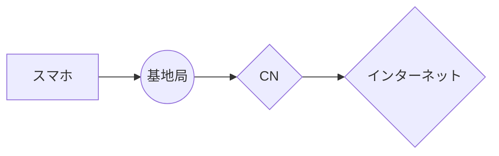

# コアネットワーク学習メモ

## まずはじめに
本ページは、通信事業者のお仕事について概要の理解を目的としています。
そのためネットで検索すると出てくる情報のみ取り扱っていますので普遍的な情報です。
特定のキャリアで使用されているサービス名や詳細な機器については一切記載しませんので
それが目的の方はブラウザバッグすることをお勧めいたします。

## コアネットワークの概要
コアネットワーク（CN）は、通信ネットワークの中核部分であり、音声通話、データ通信、メッセージングなど、さまざまな通信サービスを提供するための重要なインフラです。
コアネットワークは、エンドユーザーのデータの転送、セッションの管理、サービスの品質確保など、多くの役割を果たしています。
コアネットワークにて共通の装置としてコンポーネント化することで通信の効率化を図っています。

スマホがインターネットに接続するまでの通信経路



### コアネットワークの主要機能
- **データ転送**: ユーザーが実際に利用する音声やデータトラフィックを迅速かつ効率的に転送します。
  - *例*: スマートフォンで動画をストリーミングする際、コアネットワークは動画データをユーザーのデバイスに最適な経路で送信します。
- **セッション管理**: ユーザーのセッションを確立、維持、終了するための管理を行います。
  - *例*: VoIP通話中にユーザーが通話を開始したとき、コアネットワークは通話セッションを確立し、通話が終了するまで管理します。
- **トラフィック管理**: QoS（Quality of Service）を確保し、混雑時のトラフィックを最適に処理します。
  - *例*: ピーク時に多くのユーザーが同時にデータをダウンロードする場合、コアネットワークはトラフィックを調整し、各ユーザーに均等に帯域幅を提供します。

### コアネットワークの区分
コアネットワークは、通常、以下の三つの主要なコンポーネントに分かれます。
|                |名称                          |機能                         |例                         |
|----------------|-------------------------------|-----------------------------|-----------------------------|
|1|`CS（Circuit-Switched）`            |従来の回線交換方式を用いた音声通話に使用。            |昔の固定電話による通話が該当します。通話が確立すると、専用の回線が確保され、通話が終了するまでその回線が保持。            |
|2          |`SV（Signaling Virtualization）`            |信号処理の仮想化を行い、効率的な信号管理を実現。            |VoLTEなど、信号処理を仮想化することで、複数のサービスを同時に効率的に管理。            |
|3          |`PS（Packet-Switched）`|パケット交換方式を利用したデータ通信。|ウェブサイトの閲覧やデータのダウンロードなど、データをパケットとして送信。            |

### IMS基盤
- IMS（IP Multimedia Subsystem）は、コアネットワーク内でマルチメディアサービスを提供するためのアーキテクチャです。
  これにより、音声通話や動画通話、メッセージングなどのサービスをIPベースで統合的に管理します。
  なので、コントローラの役割を果たしている装置であると言えます。
  - *例*: スマートフォンのアプリを使ってビデオ通話を行う場合、IMSが通話の確立とメディアの転送を管理します。

### IMSの構成要素
以下の4つの装置に分かれています。

|                |名称                          |機能                         |
|----------------|-------------------------------|-----------------------------|
|1|`モバイルスイッチングセンター（MSC）`            |音声通話の管理やルーティングを行う。            |
|2          |`サービスポータル（SCP）`            |サービス提供のためのプラットフォーム。            |
|3          |`ゲートウェイ(GW)`|他のネットワーク（例えば、インターネット）との接続を担当。|
|4          |`データベース(HSS)`|ユーザー情報やネットワークの設定情報を保持する。|

## U-PlaneとC-Planeの関係
コアネットワークにおけるU-Plane（User Plane）とC-Plane（Control Plane）は、
データの流れを異なる役割で区別するための重要な概念です。

### U-Plane（User Plane）
- **役割**: ユーザーデータの送受信を担当します。エンドユーザーが利用する音声、ビデオ、データなどのトラフィックが含まれます。
  - *例*: ユーザーがオンラインゲームをプレイする際、ゲームデータがU-Planeを通じて送信されます。
- **機能**:
  - ユーザーが利用するサービスのデータを処理し、効率的に転送します。
  - 高速なデータ転送を実現するために、最適化された経路を使用します。

### C-Plane（Control Plane）
- **役割**: ネットワークの制御、管理、設定を担当します。ユーザーセッションの確立、維持、終了に関する情報を処理します。
  - *例*: ユーザーがモバイルデータを有効にする際、C-Planeがその設定を管理し、必要な情報をU-Planeに伝えます。
- **機能**:
  - ユーザーの認証、課金、セッション管理を行います。
  - U-Planeでのデータ転送をサポートするために必要なパラメータや設定を通信します。

### 相互依存性
U-PlaneとC-Planeは相互に依存しており、C-Planeがユーザーセッションを管理することで、U-Planeでのデータ転送が円滑に行われます。
たとえば、音声通話を行う際、C-Planeが通話の開始や終了を管理し、U-Planeが実際の音声データを転送します。

>MME、SGW、PCRF（これはCNではないけど場合によっては含む）をIMSの構成要素のところに加筆する必要あるので、それが残タ。
>[【mcpc1級】問題集まとめ2章](https://musen.main.jp/%e3%80%90mcpc1%e7%b4%9a%e3%80%91%e5%95%8f%e9%a1%8c%e9%9b%86%e3%81%be%e3%81%a8%e3%82%81%ef%bc%92%e7%ab%a0/)


# LAF, REF, NEFについて

## バックアップと復元の重要性
LAF、REF、NEFの情報をバックアップとして収集することは、通信機能に関連するデータや設定を保護するために重要です。
バックアップされた情報を元にしてシステムの復元が行えるため、障害が発生した際の迅速な対応やサービスの継続性を確保できます。
このように、それらが適切にバックアップされることで、通信ネットワークの信頼性が向上し、ユーザーに安定したサービスを提供することが可能となります。
以下は具体的な機能を説明します。

## LAF (Location Area Function)
- **役割**: LAFはモバイルユーザーの位置情報を管理する機能です。ユーザーが移動しても接続が維持され、通信がスムーズに行えるようになります。
- **主な機能**:
  - 位置情報の追跡と管理
  - 緊急時の迅速な位置特定
  - 位置に基づくサービスの提供

## REF (Routing Element Function)
- **役割**: REFはデータのルーティングを管理し、特定のトラフィックを適切な宛先に送信する役割を担っています。
- **主な機能**:
  - トラフィックの効率的なルーティング
  - 冗長性の確保による信頼性向上
  - QoS (Quality of Service)の維持

## NEF (Network Exposure Function)
- **役割**: NEFは外部のアプリケーションやサービスに対して、ネットワーク機能へのアクセスを提供するためのインターフェースを管理します。
- **主な機能**:
  - APIの提供と管理
  - 外部サービスとの連携
  - データの安全な提供

# 緊急通報機関への位置情報送信プロセス

## 位置情報を送信する重要性
通信をするということは位置情報を特定することに他なりません。
例えば何か困ったことが起きて警察に通報した時に、発信者がどのあたりからかけてきているのかが把握できなければ
対象の地域の警察に電話をつなぐことが困難になってしまいます。

そこで緊急通報機関への連絡時に、局データを通じて位置情報が送信されるプロセスを以下の通り記載します。

1. **緊急通報の発信**
   - ユーザーがスマートフォンや電話機から緊急番号（例：110や119）にダイヤルします。

2. **通話の接続**
   - 通話が緊急通報受理機関に接続されると、通報者の情報が通信事業者のネットワークにルーティングされます。

3. **局データの取得**
   - 通話が接続されると、通信事業者は通報者が接続している基地局の情報を取得します。この情報には、基地局のIDや位置情報（緯度・経度など）が含まれます。
     ※局データはL7層

4. **DDE（Data Distribution Element）を介した情報配信**
   - 局データが取得された後、DDEがその情報を緊急通報受理機関に配信します。DDEは局データを他のシステムに送信する役割を果たします。
     DDE領域はL2もしくはL3で動作するのが一般的です。

5. **緊急通報受理機関での情報処理**
   - 緊急通報受理機関では、受信した局データを基に通報者の位置を特定し、必要な対応（警察、消防、救急など）を行います。

---

このプロセスにより、緊急通報機関は迅速に通報者の位置を把握し、適切な支援を提供することが可能になります。通信事業者は、この局データの取得およびDDEを通じた情報配信のプロセスを理解し、緊急時における対応の重要性を認識しておく必要があります。

# IoTネットワーク設定：ルートリフレクターとRADIUS認証

このリポジトリでは、IoTトラフィックを扱うコアネットワークにおけるルートリフレクターの設定例と、ロンゲストプレフィックスマッチ（Longest Prefix Match、以下「ロンゲストマッチ」）の考慮事項を提供します。また、アクセスネットワークでのRADIUS認証の役割と設定例も含めます。この設定は、大規模な5G/IoTネットワークを想定したものです。

## BGPが必要な理由

BGP（Border Gateway Protocol）は、インターネットや大規模ネットワークの「交通整理役」と考えると分かりやすいです。特に、IoTのような大量のデバイスが接続するネットワークでは、以下のような理由でBGPが欠かせません：

- **異なるネットワークをつなぐ**: インターネットは、ISPや企業、クラウドなど、異なる「ネットワークの国（AS: Autonomous System）」の集まりです。BGPはこれらの国同士が「どこにデータを送るか」を決めるルールブック。たとえば、スマートシティのセンサーがクラウドにデータを送る際、どの経路を通るかをBGPが決めます。
- **大量のルートを管理**: IoTデバイスは数百万台にもなるため、膨大な宛先（ルート）を扱う必要があります。BGPはこれを効率的に整理し、ネットワークがパンクしないようにします。
- **柔軟な制御**: BGPは「このトラフィックは低遅延でエッジサーバーに」「このデータはクラウドに」といった細かい指示を出せます。IoTでは、低遅延が求められる自動運転や、大量データが必要な監視カメラなど、用途に応じた制御が大事。
- **信頼性**: BGPは障害があっても別の経路を選ぶので、ネットワークが止まりにくい。IoTの常時接続サービス（例：スマートメーター）には必須。

簡単に言うと、IoTネットワークがスムーズかつ安全に動くために、BGPは「道案内」と「交通ルール」を提供するんです。

## なぜBGPがコアNWとアクセスNWをつなぐのに重要か

コアネットワーク（高速バックボーン）とアクセスネットワーク（デバイスが接続する入り口）を効率的かつ安全につなぐには、BGPの設定が不可欠です。その理由は以下の通り：

- **スケーラビリティ**: IoTでは、スマートセンサーやコネクテッドカーなど、膨大なデバイスが接続。BGPは大量のルート情報を効率的に管理し、アクセスNWからコアNWへのトラフィックを適切に転送。
- **トラフィック制御**: BGPはポリシー（例：優先経路や帯域制御）を適用し、IoTトラフィックの低遅延や高信頼性を保証。たとえば、スマートシティのセンサーはエッジサーバーに、動画データはクラウドに送る、といった制御が可能。
- **柔軟性**: コアNWは外部ネットワーク（クラウドや他社NW）と接続。BGPは動的な経路選択で、アクセスNWからの多様なトラフィックを最適な宛先にルーティング。
- **セキュリティとの連携**: アクセスNWで認証されたトラフィックのみをコアNWに送るため、RADIUS認証とBGPの連携が重要。

### ルートリフレクターの役割
ルートリフレクターは、BGPのスケーラビリティを向上させるコアNWの要：
- **ピアリング簡素化**: BGPのフルメッシュでは、ルータ数\(n \

System: \)に対し\( n(n-1)/2 \)のセッションが必要。ルートリフレクターはこれをクライアント-サーバモデルに変え、セッション数を削減。
- **IoTトラフィック管理**: たとえば、スマートシティのセンサー（`10.1.1.0/24`）のトラフィックをエッジサーバーに確実に送るため、ルートリフレクターが最適な経路を配布。
- **低遅延**: 5GのURLLC（超低遅延高信頼通信）では、ルートリフレクターが迅速な経路選択で遅延を最小化。

### RADIUS認証の役割
RADIUS認証は、アクセスNWでIoTデバイスの安全な接続を保証：
- **デバイス認証**: センサーや車両が5G/Wi-Fiに接続する際、RADIUSがEAP-SIMや証明書でデバイスを検証。不正アクセスを防ぐ。
- **ポリシー適用**: デバイスごとに帯域やVLANを割り当て。例：低帯域センサーは制限付き、高帯域カメラは優先。
- **コアNW保護**: 認証済みトラフィックのみがコアNWに流れ、ルートリフレクターがそのトラフィックを正しい宛先にルーティング。
- **記録**: 接続ログを記録し、課金や異常検知に活用。

BGP（ルートリフレクター）とRADIUS認証の連携により、アクセスNWからコアNWへのトラフィックが安全かつ効率的に流れます。しかし、ロンゲストプレフィックスマッチ（ロンゲストマッチ）の設定ミスでトラフィックが誤ルーティングされるリスクがあり、以下でその確認方法を示します。

## サンプル設定：IoTトラフィック向けルートリフレクター

以下は、IoTトラフィックを扱うコアネットワークのルートリフレクター（`RR1`）の架空の設定例です。Cisco IOS/IOS-XEを想定。

### ネットワーク構成
- **ルータ**: RR1（ルートリフレクター、AS 65000）
- **クライアント**: R1、R2（IoTトラフィックを扱うBGPクライアント）
- **IoTトラフィック**: サブネット`10.1.1.0/24`（スマートシティのセンサー）がエッジサーバーに送られる。
- **課題**: 広範なルート（`10.0.0.0/8`）がロンゲストマッチで優先され、誤ルーティングのリスク。

### 設定コマンド
`RR1`をルートリフレクターとして設定し、IoT専用ルートを正しく配布。

```bash
! グローバル設定モードへ
RR1# configure terminal

! BGP AS 65000を設定
RR1(config)# router bgp 65000
RR1(config-router)# bgp router-id 1.1.1.1
RR1(config-router)# neighbor 192.168.1.2 remote-as 65000
RR1(config-router)# neighbor 192.168.1.2 update-source Loopback0
RR1(config-router)# neighbor 192.168.1.2 route-reflector-client
RR1(config-router)# neighbor 192.168.1.3 remote-as 65000
RR1(config-router)# neighbor 192.168.1.3 update-source Loopback0
RR1(config-router)# neighbor 192.168.1.3 route-reflector-client

! IoT専用ルートを広告
RR1(config-router)# network 10.1.1.0 mask 255.255.255.0
RR1(config-router)# exit

! IoTトラフィックを優先するルートマップ
RR1(config)# route-map IOT-PRIORITY permit 10
RR1(config-route-map)# match ip address prefix-list IOT-SUBNET
RR1(config-route-map)# set local-preference 200
RR1(config-route-map)# exit
RR1(config)# ip prefix-list IOT-SUBNET permit 10.1.1.0/24
RR1(config)# router bgp 65000
RR1(config-router)# neighbor 192.168.1.2 route-map IOT-PRIORITY out
RR1(config-router)# neighbor 192.168.1.3 route-map IOT-PRIORITY out
RR1(config-router)# exit

! 設定を保存
RR1(config)# end
RR1# write memory
```

### 確認コマンド
ルートリフレクターの設定と、ロンゲストマッチが正しく機能しているかを確認。

#### 1. ルートリフレクター設定の確認
```bash
RR1# show running-config | section bgp
router bgp 65000
 bgp router-id 1.1.1.1
 neighbor 192.168.1.2 remote-as 65000
 neighbor 192.168.1.2 update-source Loopback0
 neighbor 192.168.1.2 route-reflector-client
 neighbor 192.168.1.3 remote-as 65000
 neighbor 192.168.1.3 update-source Loopback0
 neighbor 192.168.1.3 route-reflector-client
 network 10.1.1.0 mask 255.255.255.0
 neighbor 192.168.1.2 route-map IOT-PRIORITY out
 neighbor 192.168.1.3 route-map IOT-PRIORITY out
```

#### 2. BGPネイバーの状態確認
```bash
RR1# show ip bgp summary
BGP router identifier 1.1.1.1, local AS number 65000
BGP table version is 10, main routing table version 10
2 network entries using 240 bytes of memory
2 path entries using 120 bytes of memory

Neighbor        V           AS MsgRcvd MsgSent   TblVer  InQ OutQ Up/Down  State/PfxRcd
192.168.1.2     4        65000    150     145       10    0    0    02:30:15        1
192.168.1.3     4        65000    148     143       10    0    0    02:30:10        1
```

#### 3. BGPルートの確認（ロンゲストマッチ）
IoT専用ルート（`10.1.1.0/24`）が広範なルート（`10.0.0.0/8`）より優先されているか確認。

```bash
RR1# show ip bgp
BGP table version is 10, local router ID is 1.1.1.1
Status codes: s suppressed, d damped, h history, * valid, > best, i - internal
Origin codes: i - IGP, e - EGP, ? - incomplete

   Network          Next Hop            Metric LocPrf Weight Path
*>i10.1.1.0/24      192.168.1.2             0    200      0 i
* i10.0.0.0/8       192.168.1.3             0    100      0 i
```

**説明**:
- `10.1.1.0/24`がベストパス（`>`）で、ルートマップによりローカルプリファレンス200で優先。
- 広範な`10.0.0.0/8`は存在するが、IoTトラフィックは正しくエッジサーバーに送られる。

#### 4. ルーティングテーブルの確認（ロンゲストマッチ）
```bash
RR1# show ip route
Codes: C - connected, S - static, R - RIP, B - BGP
       O - OSPF, I - IS-IS, L - local

Gateway of last resort is not set

      10.0.0.0/8 is variably subnetted, 2 subnets, 2 masks
B        10.1.1.0/24 [200/0] via 192.168.1.2, 02:30:15
B        10.0.0.0/8 [200/0] via 192.168.1.3, 02:30:10
C     192.168.1.0/24 is directly connected, GigabitEthernet0/0
L     192.168.1.1/32 is directly connected, Loopback0
```

**説明**:
- ルーティングテーブルで`10.1.1.0/24`がロンゲストマッチとして正しく選択され、`192.168.1.2`（エッジサーバー）に転送。
- 広範な`/8`ルートは他のトラフィックに使用され、誤ルーティングを回避。

## サンプル設定：IoT向けRADIUS認証

以下は、アクセスネットワークでのIoTデバイス認証のためのRADIUS設定例。Cisco IOSルータ（例：5G基地局やWi-Fiコントローラとして機能する`R1`）とRADIUSサーバ（例：FreeRADIUS）を連携させ、IoTデバイス（スマートセンサーなど）を認証。

### ネットワーク構成
- **ルータ**: R1（アクセスNWのエッジルータ、AS 65000、BGPクライアント）
- **RADIUSサーバ**: IP `192.168.2.10`、ポート1812（認証）、1813（アカウンティング）
- **IoTデバイス**: スマートセンサー（`10.1.1.0/24`）、EAP-TLSまたはEAP-SIMで認証。
- **目的**: 認証済みデバイスのトラフィックをコアNW（ルートリフレクター）に送り、BGPで正しい経路を選択。

### 設定コマンド
`R1`でAAA OSを有効化し、RADIUSサーバと連携。IoTデバイス認証用に802.1X/EAPを設定。

```bash
! グローバル設定モードへ
R1# configure terminal

! AAAを有効化
R1(config)# aaa new-model
R1(config)# aaa authentication dot1x default group radius


System: R1(config)# aaa authorization network default group radius
R1(config)# aaa accounting network default start-stop group radius

! RADIUSサーバを設定
R1(config)# radius server RADIUS-SRV
R1(config-radius-server)# address ipv4 192.168.2.10 auth-port 181FootNote[1812] acct-port 181FootNote[1813]
R1(config-radius-server)# key SecretKey123
R1(config-radius-server)# exit

! RADIUSグループを設定
R1(config)# aaa group server radius IOT-RADIUS
R1(config-sg-radius)# server name RADIUS-SRV
R1(config-sg-radius)# exit

! インターフェースで802.1Xを有効化（例：5G/Wi-Fi接続用）
R1(config)# interface GigabitEthernet0/1
R1(config-if)# dot1x pae authenticator
R1(config-if)# dot1x port-control auto
R1(config-if)# exit

! VLAN割り当て（IoTデバイス用）
R1(config)# vlan 100
R1(config-vlan)# name IOT-DEVICES
R1(config-vlan)# exit

! ポリシー適用（RADIUSから返される属性でVLANやQoSを設定）
R1(config)# radius-server attribute 8 include-in-access-req
R1(config)# radius-server vsa send authentication
R1(config)# radius-server vsa send accounting

! 設定を保存
R1(config)# end
R1# write memory
```

### 確認コマンド
RADIUS認証の設定と動作状況を確認。

#### 1. AAAおよびRADIUS設定の確認
```bash
R1# show running-config | section aaa
aaa new-model
aaa authentication dot1x default group radius
aaa authorization network default group radius
aaa accounting network default start-stop group radius
aaa group server radius IOT-RADIUS
 server name RADIUS-SRV
radius server RADIUS-SRV
 address ipv4 192.168.2.10 auth-port 1812 acct-port 1813
 key SecretKey123
radius-server attribute 8 include-in-access-req
radius-server vsa send authentication
radius-server vsa send accounting
```

#### 2. RADIUSサーバの状態確認
```bash
R1# show aaa servers
RADIUS: id 1, priority 1, host 192.168.2.10, auth-port 1812, acct-port 1813
 State: current UP, duration 3600s, previous duration 0s
 Dead: total time 0s, count 0
 Quarantined: No
 Authen: request 150, timeouts 0, failover 0, retransmission 0
 Author: request 150, timeouts 0, failover 0, retransmission 0
 Account: request 200, timeouts 0, failover 0, retransmission 0
```

**説明**:
- RADIUSサーバ（`192.168.2.10`）が稼働中で、認証（Authen）およびアカウンティング（Account）が正常に処理されている。

#### 3. 802.1Xセッションの確認（IoTデバイス認証）
```bash
R1# show dot1x all
Dot1x Info for GigabitEthernet0/1
-----------------------------------
PAE                       = AUTHENTICATOR
PortControl               = AUTO
ControlDirection          = Both
HostMode                  = SINGLE-HOST
ReAuthentication          = Disabled
QuietPeriod               = 60
ServerTimeout             = 30
SuppTimeout               = 30
ReAuthPeriod              = 3600
MaxReq                    = 2
TxPeriod                  = 30

Dot1x Authenticator Client List
-------------------------------
Supplicant                = 00:1A:2B:3C:4D:5E (IoT Sensor)
Session ID                = 00000001
Auth SM State             = AUTHENTICATED
Auth BEND SM State        = IDLE
Port Status               = AUTHORIZED
VLAN                      = 100 (IOT-DEVICES)
```

**説明**:
- IoTデバイス（MAC: `00:1A:2B:3C:4D:5E`）がEAP-TLSで認証済み。
- VLAN 100（`IOT-DEVICES`）が割り当てられ、トラフィックが`10.1.1.0/24`に送られる。

#### 4. BGPとの連携確認（ロンゲストマッチとの関連）
RADIUSで認証されたIoTデバイスのトラフィックが、ルートリフレクターのBGPルート（`10.1.1.0/24`）に正しく流れるか確認。

```bash
R1# show ip route 10.1.1.0
Routing entry for 10.1.1.0/24
  Known via "bgp 65000", distance 200, metric 0
  Tag 65000, type internal
  Last update from 192.168.1.2 02:30:15 ago
  Routing Descriptor Blocks:
  * 192.168.1.2, from 1.1.1.1 (RR1), 02:30:15 ago
      Route metric is 0, traffic share count is 1
      AS Hops 0
      Local Preference: 200
```

**説明**:
- IoTトラフィック（`10.1.1.0/24`）がRADIUS認証後、ルートリフレクター（`RR1`）から受信したBGPルートに従い、`192.168.1.2`（エッジサーバー）に正しく転送。
- ローカルプリファレンス200により、ロンゲストマッチが正しく機能。

## RADIUS認証とロンゲストマッチの関連
RADIUS認証は、IoTデバイスのトラフィックをコアNWに送る前に、VLANやQoSを割り当てます。これがBGPルートマップ（例：`IOT-PRIORITY`）と一致しない場合、ロンゲストマッチの問題が悪化する可能性があります：
- **例**: RADIUSがデバイスをVLAN 100（`10.1.1.0/24`）に割り当てるが、ルートリフレクターが広範な`10.0.0.0/8`を優先すると、トラフィックが誤った宛先（例：インターネット）に送られる。
- **解決策**: RADIUSの属性（VLANやQoS）をBGPのコミュニティタグにマッピングし、ルートリフレクターで正しい経路を選択。

## ロンゲストマッチの問題
IoTネットワークで、ロンゲストプレフィックスマッチ（ロンゲストマッチ）が問題になるケース：
- **広範なルートの優先**: `10.0.0.0/8`が`10.1.1.0/24`を上書きし、IoTトラフィックがクラウドではなくインターネットに誤ルーティング。
- **設定ミス**: ルートリフレクターのルートマップやVRFの設定ミスで、誤った経路が選択。
- **解決策**: 上記のprefix-listとroute-mapで、IoT専用ルートを優先。RADIUSのVLAN割り当てをBGPポリシーに反映。
