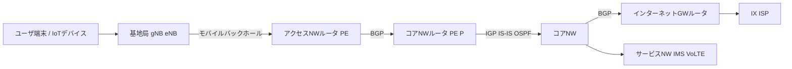

# コアネットワーク学習メモ

## 目次
- [まずはじめに](#まずはじめに)
- [コアネットワークとアクセスネットワークの概要](#コアネットワークとアクセスネットワークの概要)
- [バックアップと復元の重要性](#バックアップと復元の重要性)
- [緊急通報機関への位置情報送信プロセス](#緊急通報機関への位置情報送信プロセス)
- [IoTネットワーク設定：ルートリフレクターとRADIUS認証](#IoTネットワーク設定：ルートリフレクターとRADIUS認証)
- [コアネットワークにおける仮想化技術の概要](#コアネットワークにおける仮想化技術の概要)

## まずはじめに
このリポジトリは、通信事業者のコアネットワーク（CN）の概要を初心者が理解するための学習メモです。インターネットから得られる普遍的な情報に基づき、特定のキャリアや機器の詳細は記載しません。詳細な実装情報が必要な場合は、他の専門資料を参照してください。

特に、IoT（Internet of Things）のような大量のデバイスが接続する現代のネットワークでは、コアネットワークがデータの高速転送、認証、ルーティングを支えます。このメモでは、大規模MNO（移動体通信事業者）のネットワーク全体像、コアネットワークとアクセスネットワークの役割、バックアップや位置情報の重要性、そしてIoT向けのBGP（ルートリフレクター）やRADIUS認証の設定例を紹介します。

## コアネットワークとアクセスネットワークの概要
大規模MNOのネットワークは、以下の3つの階層で構成されています：

1. **アクセスネットワーク（AN, RAN）**:
   - ユーザーデバイスやIoTデバイスが最初に接続する「入り口」。基地局（eNodeB/gNodeB）やWi-Fiアクセスポイント、固定網（例：FTTH）を通じて接続。
   - モバイルバックホール（L2/L3伝送ネットワーク）でトラフィックを収容ルータ（PE相当）に中継。
   - 役割：デバイス認証（例：RADIUS）、初期トラフィック制御。
   - 例：IoTセンサーが5G基地局に接続し、RADIUSで認証後、データがコアNWに送られる。

2. **コアネットワーク（CN, IPコアNW）**:
   - 全国のトラフィックを集約・転送する高速バックボーン。インターネット接続点（IX/ISP）やモバイルコア機器（EPC: MME/SGW/PGW、5GC: AMF/SMF/UPF）と接続。
   - 役割：高速データ転送、セッション管理、ルーティング（例：BGP）。
   - 例：IoTデバイスのデータがクラウドに送られる際、BGPで最適経路を選択。

3. **サービスネットワーク（IMS, VoLTE, インターネット）**:
   - VoLTE、SMS、データ通信などのサービスを提供。IMS（IP Multimedia Subsystem）やIMS-PGWが関与。
   - 役割：マルチメディアサービスや外部ネットワークとの連携。
   - 例：VoLTE通話のセッションをIMSが管理し、データパケットをコアNW経由で転送。

以下は、ネットワーク全体の通信経路：



### コアネットワークとアクセスネットワークの役割
| 項目 | 内容 |
|------|------|
| **コアネットワーク（CN）** | 音声・データ通信・認証・ルーティングを担う中核NW。BGPでトラフィックを最適化。EPC/5GCでモバイル通信を管理。 |
| **アクセスネットワーク（AN）** | ユーザデバイス/IoTデバイスの入り口（基地局/Wi-Fi/固定網）。RADIUSで認証し、初期トラフィック制御。 |

### コアネットワークの主要機能
- **データ転送**: ユーザーデータ（音声、動画、センサーデータ）を高速かつ効率的に転送。
  - *例*: IoTセンサーのデータがクラウドに送信される際、コアネットワークが最適な経路を選択。
- **セッション管理**: ユーザーの接続を確立、維持、終了。
  - *例*: VoLTE通話の開始と終了をIMSが管理。
- **トラフィック管理**: QoS（Quality of Service）で混雑時も安定した通信を提供。
  - *例*: ピーク時にIoTデバイスのデータと動画ストリーミングを優先度に応じて処理。

### コアネットワークの区分
コアネットワークは以下のように分類されます：
| 名称 | 機能 | 例 |
|------|------|-----|
| **CS（Circuit-Switched）** | 回線交換方式で音声通話を処理。 | 従来の固定電話の通話。専用回線を確保し、安定した通話を提供。 |
| **PS（Packet-Switched）** | パケット交換方式でデータ通信を処理。 | ウェブ閲覧やIoTデータの送信。データをパケットに分割して効率的に転送。 |
| **SV（Signaling Virtualization）** | 信号処理を仮想化し、効率的な管理を実現。 | VoLTEやIoTの信号管理を一元化。 |

### IMS基盤
IMS（IP Multimedia Subsystem）は、IPベースで音声や動画などのマルチメディアサービスを統合的に管理するアーキテクチャです。IoTでは、デバイス認証やセッション管理を効率化します。
- *例*: VoLTE通話やIoTデバイスのデータセッションをIMSが管理。

#### IMSの構成要素
| 名称 | 機能 |
|------|------|
| **MSC（Mobile Switching Center）** | 音声通話の管理とルーティング。 |
| **MME（Mobility Management Entity）** | デバイス認証やモビリティ管理。IoTデバイスのセッション管理に必須。 |
| **SGW（Serving Gateway）** | ユーザーデータの転送を担当。基地局とコアNW間のデータ中継。 |
| **PGW（Packet Data Network Gateway）** | 外部ネットワーク（インターネットやクラウド）との接続。 |
| **HSS（Home Subscriber Server）** | ユーザー情報や認証データを保持。RADIUSと連携してIoTデバイス認証を支援。 |
| **PCRF（Policy and Charging Rules Function）** | QoSや課金ポリシーを管理。IoTトラフィックの優先度設定に活用。*注*: 厳密にはIMSの一部ではないが、関連してQoS管理に寄与。 |
| **SCP（Service Control Point）** | サービス提供のプラットフォーム。 |

### U-PlaneとC-Planeの関係
- **U-Plane（User Plane）**: ユーザーデータ（音声、動画、IoTデータ）の転送を担当。
  - *例*: IoTセンサーのデータがUPF（User Plane Function）経由でクラウドに送信。
- **C-Plane（Control Plane）**: セッション管理や認証を担当。MMEやHSSが関与。
  - *例*: IoTデバイスの認証をRADIUSとHSSで処理し、セッションを確立。
- **相互依存性**: C-Planeが認証やポリシーを設定し、U-Planeがデータ転送を実行。IoTでは、RADIUS（C-Plane）がアクセスNWで認証を行い、BGP（U-Plane）がコアNWでデータルーティングを最適化。

## バックアップと復元の重要性
LAF、REF、NEFの情報をバックアップとして収集することは、通信機能に関連するデータや設定を保護するために重要です。バックアップされた情報を元にしてシステムの復元が行えるため、障害が発生した際の迅速な対応やサービスの継続性を確保できます。このように、それらが適切にバックアップされることで、通信ネットワークの信頼性が向上し、ユーザーに安定したサービスを提供することが可能となります。

### LAF (Location Area Function)
- **役割**: モバイルユーザーの位置情報を管理する機能。ユーザーが移動しても接続が維持され、通信がスムーズに行える。
  - *注*: LAFはキャリアや文脈依存の用語で、3GPP標準ではAMF（Access and Mobility Management Function）に相当する場合がある。
- **主な機能**:
  - 位置情報の追跡と管理
  - 緊急時の迅速な位置特定
  - 位置に基づくサービスの提供（例：地域ごとの広告配信）

### REF (Routing Element Function)
- **役割**: データのルーティングを管理し、特定のトラフィックを適切な宛先に送信。
  - *注*: REFは標準用語ではなく、BGPやUPF（User Plane Function）に類似するキャリア固有の機能を示す場合がある。
- **主な機能**:
  - トラフィックの効率的なルーティング
  - 冗長性の確保による信頼性向上
  - QoS（Quality of Service）の維持

### NEF (Network Exposure Function)
- **役割**: 外部のアプリケーションやサービスに対して、ネットワーク機能へのアクセスを提供するインターフェースを管理。
- **主な機能**:
  - APIの提供と管理
  - 外部サービスとの連携（例：IoTプラットフォームとのデータ共有）
  - データの安全な提供

## 緊急通報機関への位置情報送信プロセス
緊急通報（例：110、119）では、位置情報が迅速に特定される必要があります。以下は、通信事業者が位置情報を緊急通報機関に送信するプロセス：

1. **通報発信**: ユーザーが緊急番号にダイヤル。
2. **接続**: 通話がコアNW経由で緊急通報受理機関に接続。
3. **位置情報取得**: MMEやAMFが基地局データ（例：Cell ID）から位置情報を取得。
4. **情報配信**: 位置情報がE-CSCF（Emergency Call Session Control Function）や位置情報配信機能を経由して緊急機関に送信。
5. **処理**: 緊急機関が位置情報をもとに適切な対応（警察、消防、救急など）を実施。

*注*: 位置情報はC-Plane（例：S1-APプロトコル）で処理され、キャリア固有の「DDE（Data Distribution Element）」のような機能が存在する場合がある。

## IoTネットワーク設定：ルートリフレクターとRADIUS認証
このセクションでは、IoTトラフィックを扱うコアネットワークでのルートリフレクターと、アクセスネットワークでのRADIUS認証の設定例を示します。設定は大規模5G/IoTネットワークを想定し、ロンゲストプレフィックスマッチ（以下「ロンゲストマッチ」）の問題にも対応します。

### BGPが必要な理由
BGP（Border Gateway Protocol）は、ネットワークの「交通整理役」です。IoTネットワークや大規模MNOで重要な理由：
- **異なるネットワークの接続**: アクセスNW、コアNW、IX/ISP、サービスNW（IMS/VoLTE）をリンク。例：IoTセンサーのデータがクラウドに送られる経路を決定。
- **大量ルート管理**: 数百万のIoTデバイスの宛先を効率的に整理。
- **柔軟な制御**: 低遅延が必要な自動運転や、大量データの監視カメラを適切な宛先に振り分け。例：VoLTEトラフィックをIMSに優先送信。
- **信頼性**: 災害時（例：地震）に地域NWが障害を起こしても、代替経路を選択し常時接続を保証。

#### BGPの使われ方
大規模MNOでは、以下のようにBGPを活用：
- **アクセスNWとコアNW間**: アクセスNW（例：AS65010、AS65011）とコアNW（例：AS65000）は別ASで運用。境界ルータでBGPを使い、経路交換やフィルタリングを実施。
  - 例：地域NWのトラフィックをコアNWに集約し、負荷分散や障害時の迂回を実現。
- **コアNWとIX/ISP間**: コアNWからインターネット接続点へのトラフィックをBGPで制御。
- **コアNWとサービスNW間**: VoLTEやSMSのIPパケットをIMSやIMS-PGWにルーティング。冗長化やポリシー制御のためBGPを部分的に使用。
- **コアNW内**: IGP（IS-ISまたはOSPF）で内部経路を管理し、BGPで外部や境界の経路を制御。

#### AS分割の理由
アクセスNWとコアNWでASを分ける理由：
- **運用ドメインの分割**: 地域ごとの運用・保守部門の責任を明確化（例：東日本/西日本のアクセスNW）。
- **経路計算負荷の軽減**: 大規模NWのルート情報を集約し、ルータの負荷を低減。
- **トラフィックポリシー制御**: VoLTE、インターネット、法執行対応（例：緊急通報）のトラフィックを個別に管理。
- **災害対応**: 地震などで地域NWが分断された場合、AS単位で経路を切り離し、影響を局限。

#### BGPの具体的な利用例
- **アクセスNWとコアNW間**: 収容ルータ（PE）とコアNWルータ（PE/P）でBGPを使い、IoTトラフィックの経路を制御。例：センサーのデータをエッジサーバーに優先送信。
- **コアNWとIX/ISP間**: インターネット向けトラフィックを最適なIXにルーティング。
- **VoLTE/SMS**: IMS-PGWへのトラフィックをBGPで制御し、冗長経路を確保。例：地域NW障害時に別地域のIMSに迂回。
- **トラフィックエンジニアリング**: 災害時の負荷分散や、IoTデバイスの低遅延通信を優先。

#### ルートリフレクターの役割
- **ピアリング簡素化**: フルメッシュのセッション数\( n(n-1)/2 \)を削減。
- **IoTトラフィック管理**: 例：`10.1.1.0/24`（センサー）のトラフィックをエッジサーバーに送信。
- **低遅延**: 5GのURLLCで迅速な経路選択。

#### RADIUS認証の役割
- **デバイス認証**: EAP-SIMや証明書でIoTデバイスを検証。HSSと連携してユーザー情報を照合。
- **ポリシー適用**: VLANやQoSを割り当て（例：低帯域センサー）。
- **コアNW保護**: 認証済みトラフィックのみをBGPでルーティング。
- **記録**: ログで課金や異常検知。

### サンプル設定：ルートリフレクター
コアNWのルートリフレクター（`RR1`）の設定例。Cisco IOS/IOS-XEを想定。

#### ネットワーク構成
- **ルータ**: RR1（AS 65000）
- **クライアント**: R1（アクセスNW、AS65010）、R2（アクセスNW、AS65011）
- **IoTトラフィック**: `10.1.1.0/24`（センサー）がエッジサーバーに送信。
- **課題**: 広範な`10.0.0.0/8`がロンゲストマッチで優先されるリスク。

#### 設定コマンド
```bash
! グローバル設定モード
RR1# configure terminal

! BGP AS 65000
RR1(config)# router bgp 65000
RR1(config-router)# bgp router-id 1.1.1.1
RR1(config-router)# neighbor 192.168.1.2 remote-as 65010
RR1(config-router)# neighbor 192.168.1.2 update-source Loopback0
RR1(config-router)# neighbor 192.168.1.2 route-reflector-client
RR1(config-router)# neighbor 192.168.1.3 remote-as 65011
RR1(config-router)# neighbor 192.168.1.3 update-source Loopback0
RR1(config-router)# neighbor 192.168.1.3 route-reflector-client

! IoTルート広告
RR1(config-router)# network 10.1.1.0 mask 255.255.255.0
RR1(config-router)# exit

! IoTトラフィック優先
RR1(config)# route-map IOT-PRIORITY permit 10
RR1(config-route-map)# match ip address prefix-list IOT-SUBNET
RR1(config-route-map)# set local-preference 200
RR1(config-route-map)# exit
RR1(config)# ip prefix-list IOT-SUBNET permit 10.1.1.0/24
RR1(config)# router bgp 65000
RR1(config-router)# neighbor 192.168.1.2 route-map IOT-PRIORITY out
RR1(config-router)# neighbor 192.168.1.3 route-map IOT-PRIORITY out
RR1(config-router)# exit

! 設定保存
RR1(config)# end
RR1# write memory
```

#### 確認コマンド
##### 1. ルートリフレクター設定確認
```bash
RR1# show running-config | section bgp
router bgp 65000
 bgp router-id 1.1.1.1
 neighbor 192.168.1.2 remote-as 65010
 neighbor 192.168.1.2 update-source Loopback0
 neighbor 192.168.1.2 route-reflector-client
 neighbor 192.168.1.3 remote-as 65011
 neighbor 192.168.1.3 update-source Loopback0
 neighbor 192.168.1.3 route-reflector-client
 network 10.1.1.0 mask 255.255.255.0
 neighbor 192.168.1.2 route-map IOT-PRIORITY out
 neighbor 192.168.1.3 route-map IOT-PRIORITY out
```

##### 2. BGPネイバー状態
```bash
RR1# show ip bgp summary
BGP router identifier 1.1.1.1, local AS number 65000
BGP table version is 10, main routing table version 10
2 network entries using 240 bytes of memory
2 path entries using 120 bytes of memory

Neighbor        V           AS MsgRcvd MsgSent   TblVer  InQ OutQ Up/Down  State/PfxRcd
192.168.1.2     4        65010    150     145       10    0    0    02:30:15        1
192.168.1.3     4        65011    148     143       10    0    0    02:30:10        1
```

##### 3. BGPルート確認（ロンゲストマッチ）
```bash
RR1# show ip bgp
BGP table version is 10, local router ID is 1.1.1.1
Status codes: s suppressed, d damped, h history, * valid, > best, i - internal
Origin codes: i - IGP, e - EGP, ? - incomplete

   Network          Next Hop            Metric LocPrf Weight Path
*>i10.1.1.0/24      192.168.1.2             0    200      0 i
* i10.0.0.0/8       192.168.1.3             0    100      0 i
```

**説明**: `10.1.1.0/24`が優先（`>`）、ローカルプリファレンス200でエッジサーバーに送信。

##### 4. ルーティングテーブル確認
```bash
RR1# show ip route
Codes: C - connected, S - static, R - RIP, B - BGP
       O - OSPF, I - IS-IS, L - local

Gateway of last resort is not set

      10.0.0.0/8 is variably subnetted, 2 subnets, 2 masks
B        10.1.1.0/24 [200/0] via 192.168.1.2, 02:30:15
B        10.0.0.0/8 [200/0] via 192.168.1.3, 02:30:10
C     192.168.1.0/24 is directly connected, GigabitEthernet0/0
L     192.168.1.1/32 is directly connected, Loopback0
```

**説明**: `10.1.1.0/24`がロンゲストマッチで正しく選択。

### サンプル設定：RADIUS認証
アクセスNWでのIoTデバイス認証。Cisco IOSルータ（`R1`）とRADIUSサーバを連携。

#### ネットワーク構成
- **ルータ**: R1（アクセスNW、AS65010、BGPクライアント）
- **RADIUSサーバ**: `192.168.2.10`、ポート1812（認証）、1813（アカウンティング）
- **IoTデバイス**: センサー（`10.1.1.0/24`）、EAP-TLS/EAP-SIM認証。
- **目的**: 認証済みトラフィックをコアNWに送り、BGPでルーティング。

#### 設定コマンド
```bash
! グローバル設定モード
R1# configure terminal

! AAA有効化
R1(config)# aaa new-model
R1(config)# aaa authentication dot1x default group radius
R1(config)# aaa authorization network default group radius
R1(config)# aaa accounting network default start-stop group radius

! RADIUSサーバ設定
R1(config)# radius server RADIUS-SRV
R1(config-radius-server)# address ipv4 192.168.2.10 auth-port 1812 acct-port 1813
R1(config-radius-server)# key SecretKey123
R1(config-radius-server)# exit

! RADIUSグループ
R1(config)# aaa group server radius IOT-RADIUS
R1(config-sg-radius)# server name RADIUS-SRV
R1(config-sg-radius)# exit

! インターフェースで802.1X
R1(config)# interface GigabitEthernet0/1
R1(config-if)# dot1x pae authenticator
R1(config-if)# dot1x port-control auto
R1(config-if)# exit

! VLAN割り当て
R1(config)# vlan 100
R1(config-vlan)# name IOT-DEVICES
R1(config-vlan)# exit

! ポリシー適用
R1(config)# radius-server attribute 8 include-in-access-req
R1(config)# radius-server vsa send authentication
R1(config)# radius-server vsa send accounting

! 設定保存
R1(config)# end
R1# write memory
```

#### 確認コマンド
##### 1. AAA/RADIUS設定確認
```bash
R1# show running-config | section aaa
aaa new-model
aaa authentication dot1x default group radius
aaa authorization network default group radius
aaa accounting network default start-stop group radius
aaa group server radius IOT-RADIUS
 server name RADIUS-SRV
radius server RADIUS-SRV
 address ipv4 192.168.2.10 auth-port 1812 acct-port 1813
 key SecretKey123
radius-server attribute 8 include-in-access-req
radius-server vsa send authentication
radius-server vsa send accounting
```

##### 2. RADIUSサーバ状態
```bash
R1# show aaa servers
RADIUS: id 1, priority 1, host 192.168.2.10, auth-port 1812, acct-port 1813
 State: current UP, duration 3600s, previous duration 0s
 Dead: total time 0s, count 0
 Quarantined: No
 Authen: request 150, timeouts 0, failover 0, retransmission 0
 Author: request 150, timeouts 0, failover 0, retransmission 0
 Account: request 200, timeouts 0, failover 0, retransmission 0
```

##### 3. 802.1Xセッション確認
```bash
R1# show dot1x all
Dot1x Info for GigabitEthernet0/1
-----------------------------------
PAE                       = AUTHENTICATOR
PortControl               = AUTO
ControlDirection          = Both
HostMode                  = SINGLE-HOST
ReAuthentication          = Disabled
QuietPeriod               = 60
ServerTimeout             = 30
SuppTimeout               = 30
ReAuthPeriod              = 3600
MaxReq                    = 2
TxPeriod                  = 30

Dot1x Authenticator Client List
-------------------------------
Supplicant                = 00:1A:2B:3C:4D:5E (IoT Sensor)
Session ID                = 00000001
Auth SM State             = AUTHENTICATED
Auth BEND SM State        = IDLE
Port Status               = AUTHORIZED
VLAN                      = 100 (IOT-DEVICES)
```

##### 4. BGP連携確認
```bash
R1# show ip route 10.1.1.0
Routing entry for 10.1.1.0/24
  Known via "bgp 65010", distance 200, metric 0
  Tag 65000, type external
  Last update from 192.168.1.2 02:30:15 ago
  Routing Descriptor Blocks:
  * 192.168.1.2, from 1.1.1.1 (RR1), 02:30:15 ago
      Route metric is 0, traffic share count is 1
      AS Hops 1
      Local Preference: 200
```

**説明**: RADIUS認証後、トラフィックが`10.1.1.0/24`に正しくルーティング。

### RADIUS認証とロンゲストマッチの関連
RADIUSはVLANやQoSを割り当て、BGPルートマップ（`IOT-PRIORITY`）と一致しないと、ロンゲストマッチの問題が発生：
- **例**: VLAN 100（`10.1.1.0/24`）が割り当てられるが、`10.0.0.0/8`が優先され、誤ルーティング。
- **解決策**: RADIUS属性をBGPコミュニティタグにマッピング。

### ロンゲストマッチの問題
- **広範なルート**: `10.0.0.0/8`が`10.1.1.0/24`を上書き。
- **設定ミス**: ルートマップやVRFの誤設定。
- **解決策**: prefix-listとroute-mapでIoTルートを優先。RADIUSのVLANをBGPに反映。


# コアネットワークにおける仮想化技術の概要

---

## ① コアNWにおける仮想化技術の概要

### 仮想化技術導入の背景と歴史

通信ネットワークの進化とともに、サービスの多様化やトラフィック急増が進み、従来の物理アプライアンス中心のネットワーク構成は課題を抱えるようになりました。

- 拡張の柔軟性が低く、新規サービス開始やトラフィック増加に対応するためには、物理機器の調達・設置に多大な時間とコストがかかる。  
- 専用機器ごとの管理・保守の複雑さにより、運用負荷が増大。  
- サービス展開のスピードが遅く、市場投入までにタイムラグが発生。  

これらの問題を解決するために、2010年代半ばから通信事業者はネットワーク機能の仮想化（NFV）を推進し、汎用サーバ上でネットワーク機能をソフトウェア化することで柔軟かつ迅速なリソース割当を可能にしました。また、SDNを併用して細かなトラフィック制御や品質保証も実現しています。

---

### 背景  
従来の物理アプライアンスによるEPC/5GC構成は柔軟性が低く、設備増強や障害対応に時間がかかる。

---

### 解決策

- **NFV（Network Functions Virtualization）**  
  MME、SGW、PGW、PCRFなどをVMまたはコンテナ化し、汎用サーバ上で稼働させる。

- **MANO（Management and Orchestration）**  
  ETSI NFV-MANOに準拠し、VIM（例：OpenStack）、VNFM、NFVOで構成。  
  リソース管理、スケーリング、障害復旧（オートヒーリング）を一元管理する。

- **SDN（Software Defined Networking）**  
  コアNWのルータ・スイッチの制御プレーンとデータプレーンを分離し、動的に経路変更・QoS制御を実施。  
  BGPによる物理NW制御だけでなく、SDN Controller（例：ONOS、OpenDaylight）でフロー単位制御を行う。

- **AWS/Azure/GCPの活用**  
  VPC/VPNを使った仮想コアNW構築。  
  Route53やTransit Gateway、Direct ConnectをBGP連携。  
  オートヒーリングにより、インスタンス障害時の自動復旧・再配置を実現（例：Auto Scaling Group、Lambdaによる復旧トリガ）。

---

## ② MANOを用いたコアNW運用モデル

### MANOの役割

| 機能                         | 内容                                 | 例                           |
|------------------------------|------------------------------------|------------------------------|
| VIM（Virtualized Infrastructure Manager） | 仮想リソース（VM、コンテナ、ネットワーク）の管理 | OpenStack、AWS EC2/VPC       |
| VNFM（VNF Manager）           | VNF（仮想化ネットワーク機能）のライフサイクル管理 | MME/SGW/PGWのスケーリング、ヘルスチェック |
| NFVO（NFV Orchestrator）      | VNF群のサービスチェーン構築・運用管理         | VoLTEサービスのオーケストレーション    |

### 適用例  
- IoTトラフィックが増加した際、VNFMがPGWのインスタンスをスケールアウト。  
- コアNW障害発生時、NFVOが代替経路の設定、仮想NWを再構成しサービス継続。

---

## ③ VNFの導入による運用効率化

### VNF（Virtual Network Function）例（具体的な例は省略）

### 利点  
- ハードウェア依存排除による迅速な設備増設。  
- テスト環境と本番環境の構成統一。  
- オートスケールとオートヒーリングにより運用工数削減。

### 運用例  
- AWS EC2上でvPGWを展開、Auto Scaling Groupを設定し負荷増加時に自動追加。  
- CloudWatchアラームを利用しCPU/メモリ使用率が閾値超過時にLambdaがトリガーし、Auto Healingで障害インスタンスを削除・再生成。

---

## ④ SDNとコアNW仮想化の連携

### SDNの導入理由  
- BGPだけでは細粒度なフロー制御が困難。  
- IoT、VoLTE、MECなどアプリケーションごとのトラフィック制御が必要。

### 構成例  
- SDN Controller（OpenDaylight）を用いてUPF/PGW周辺のトラフィック制御。  
- URLフィルタリングやQoS設定を動的に適用。  
- Disaster Recoveryとして経路障害時の自動切り替え。

### 例  
- IoTトラフィック（10.1.1.0/24）がエッジサーバー障害時に別リージョンへ転送。  
- VoLTE通信の遅延監視、経路再計算による即時迂回。

---

## ⑤ AWSオートヒーリングとの連携

### オートヒーリングの位置づけ  
- MANOによるVNF監視・障害検知。  
- AWS Auto Scalingによるインスタンス復旧・再配置。  
- Route53でDNSフェイルオーバーを実装しコアNWサービス可用性確保。

### 適用例  
- vMME障害検知時：  
  CloudWatchで死活監視。  
  LambdaがEC2再起動。  
  Auto Scaling Groupで代替インスタンス起動。

- 仮想BGPルータ（vRR）障害時：  
  Transit Gateway/BGPセッションの自動切り替え。  
  冗長構成によりダウンタイムを最小化。
